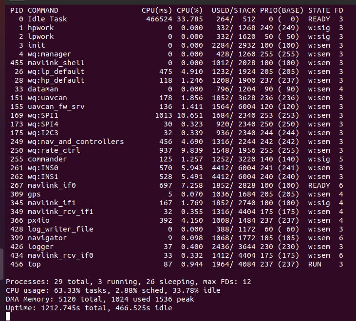

# Control allocation in PX4

Repository for the code specific to Firefly, a 15kg coaxial octorotor.

The vehicle is controlled using px4 software and Pixhawk 4. The purpose
of this to:
- Read live rotor data (throttle, RPM, current, voltage, etc) from ESC
  and other sensors
- Send commands (e.g. delta_throttle) to the Control Allocation unit
  inside the px4 based on the collected rotor data
- Write input data (from the rotor) and output data (commands sent to px4)
  to a log file

This effectively closes the px4 control loop with rotor data (throttle,
RPM, current, voltage, etc). The idea is to incorporate secondary goals
(e.g power, vibration, noise) into the control allocation unit of
***overactuated*** vehicles. Of course none of these is possible for systems
that have only one actuator per degree of freedom.

## What do we need?
- Pixhaw 4 board
- Px4 software at version 1.12.0
- Knowledge of the general Px4 architecture

A good place to start are the links

- https://docs.px4.io/v1.12/en/concept/px4_systems_architecture.html
- https://docs.px4.io/v1.12/en/concept/architecture.html
- https://docs.px4.io/v1.12/en/flight_stack/controller_diagrams.html
- https://docs.px4.io/v1.12/en/hardware/reference_design.html


## Changes to the source code

As of Nov 2021 the steps are

- Set up the developer toolchain following instructions in https://docs.px4.io/v1.12/en/dev_setup/dev_env_linux_ubuntu.html

- Download the code using
```
git clone https://github.com/PX4/PX4-Autopilot.git --recursive
```

- Do not build the code just yet. First, find v1.12.0 using
```
git tag -n
```


- Then, checkout version v.1.12.0 using
```
git checkout tags/v1.12.0 -b v1.12.0-branch
```

- Now build the code using
```
make px4_fmu-v5_default
```


- Add a topic to capture mixer in/out information by following instructions in https://docs.px4.io/v1.12/en/middleware/uorb.html. Then, create an application to test the newly created topic by following instructions in https://docs.px4.io/v1.12/en/modules/hello_sky.html.  You can check what files are using your newly created topics using
```
grep -R --exclude-dir={.git,build} "firefly_ctrlalloc" .
```

- In this particular example an app called ```firefly``` was created to read and write two new topics ```firefly_ctrlalloc``` and ```firefly_delta```. The modified sourcode can be compiled and uploaded to a Pixhawk 4 (physical device) using a USB cable and running the command
```
make px4_fmu-v5_default upload
```


- After uploaidng the code, the app ```firefly``` can be tested by connecting via mavlink
```
./Tools/mavlink_shell.py
```


- Now we need to open QGroundControl and set some parameter values (https://docs.px4.io/v1.12/en/advanced_config/parameter_reference.html)
```
SYS_AUTOSTART   12001       Auto-start script index (https://dev.px4.io/master/en/airframes/airframe_reference.html)
SYS_USE_IO      disabled    Set usage of IO board
```

- Make sure to reboot the vehicles after saving changes to te above parameters. After that, we need to look for the files that implement the mixer (control allocation unit). We can see the modules that are currently running using the command
```
top
```


- Another option is to directly check the status of modules we are interested in
```
mc_pos_control status
mc_att_control status
px4io status
```


- Another important componenet to check for are topics. Two important topics are ```actuator_controls``` and ```actuator_outputs```. This can be checked using
```
listener actuator_controls_0
listener actuator_outputs
```


- The first module we are looking for is ```px4io```, we can find it running
```
 find . -name "px4io.c*"
```


- We can edit the file ```src/drivers/px4io/px4io.cpp``` to test its effect on the topic ```actuator_outputs```


- After uploading the code to the board and connecting to the mavlink shell we can verify the change in ```actuator_outputs -i 0```. But if we connect the actuators (motors) to the ```I/O PWM OUT``` in the Pixhawk 4 board they do not spin (the disarmed 900 us sinal is being sent instead). We conclude that ```src/drivers/px4io/px4io.cpp``` manages the interaction with the IO board (check https://docs.px4.io/v1.12/en/hardware/reference_design.html) but not the mixing nor the actual output to the actuators.


- In the same way we can edit the file ```src/lib/mixer_module/mixer_module.cpp``` to test its effect on the topic ```actuator_outputs```


- After uploading the code to the board and connecting to the mavlink shell we can verify the change in ```actuator_outputs -i 1```. This change is only seen while the vehicle is armed. If we connect the actuators (motors) to the ```FMU PWM OUT``` in the Pixhawk 4 board they do spin. We conclude that ```src/lib/mixer_module/mixer_module.cpp``` manages the interaction with the ```FMU PWM OUT``` connector of Pixhawk 4. This is what we wanted !!


- The linearity can be checked with ```outputs[i] = -1 + 0.1*i;``` and the result is
```
output: [1000.0000, 1047.0000, 1095.0000, 1142.0000, 1190.0000, 1237.0000, 1285.0000, 1332.0000]
```

## Custom control allocation

In order to have a custom control allocation we need to

- Find out the linear relashionship betwwen ```controls[i] ``` and ```outputs[i] ```
```
outputs = A * controls + B
```
Therefore, A needs to be a [8x4] matrix and B is a [8x1] vector. To find A and B we use

- Use ```work_queue status ```

## Optimum seeking control application (running on companion computer)

- Create a wifi connection for Raspberry (taken from https://binaryupdates.com/how-to-configure-wifi-on-raspberry-pi-4/)

- Type ```sudo iwlist wlan0 scan``` and make sure the WiFi connection you want is visible.

- Add to ```/etc/wpa_supplicant/wpa_supplicant.conf``` the following fields
```
network={
    ssid="You SSID Name"
    psk="Your WiFI Password"
    key_mgmt=WPA-PSK
}
```


